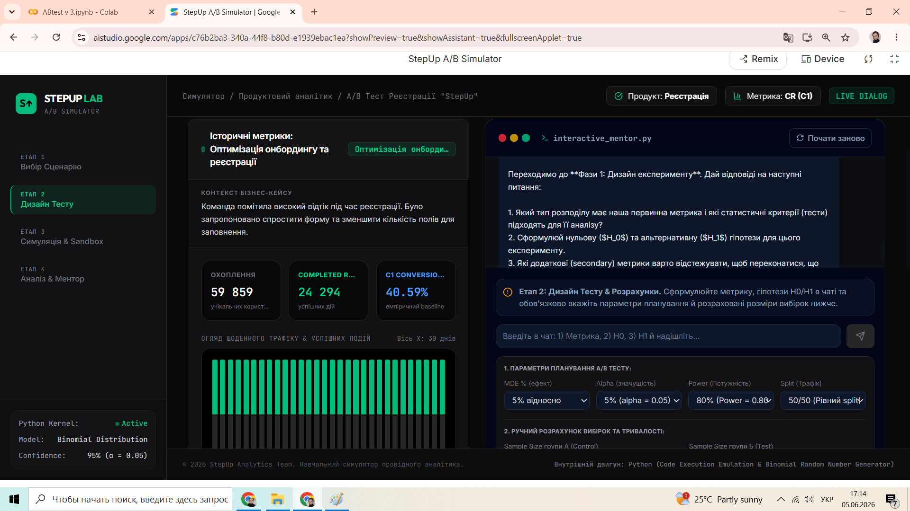
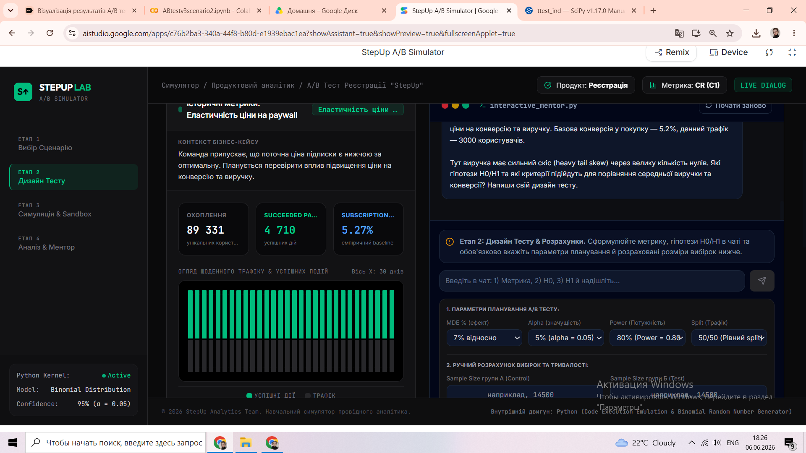
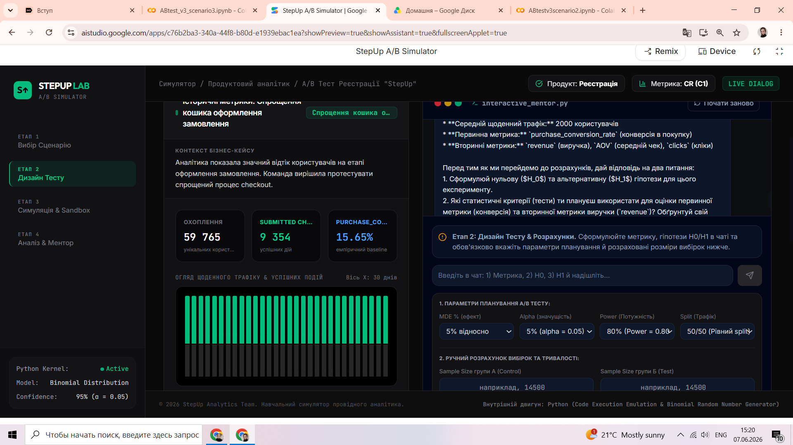
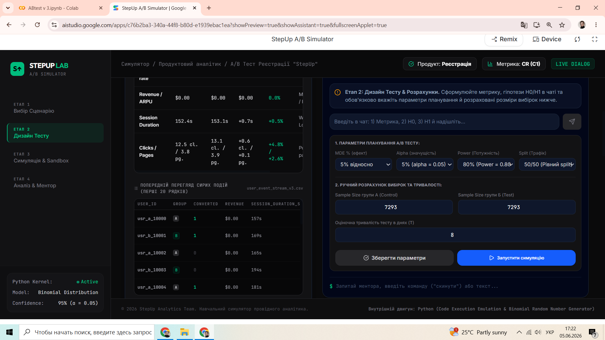
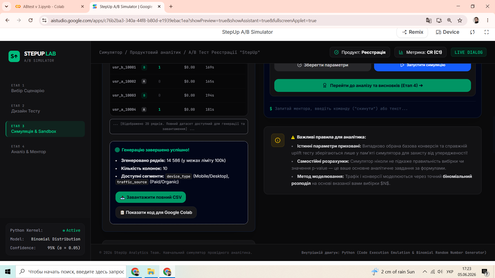
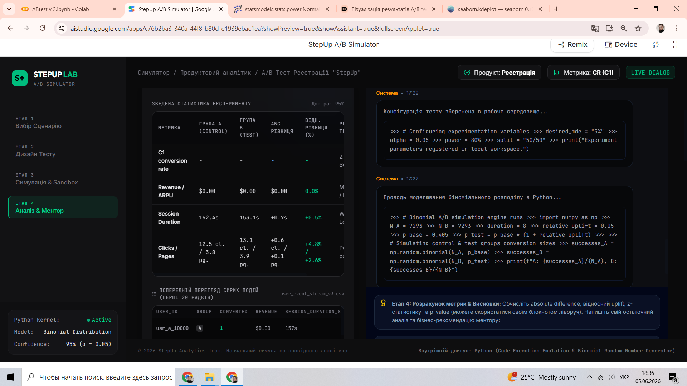

# AB-testing-simulator
End-to-end A/B testing project with experiment design, simulation, statistical testing, and visualization.
# AB-testing-simulator

End-to-end A/B testing project with experiment design, simulation, statistical testing, and visualization.

## Опис проєкту

StepUp A/B Testing Simulator — навчальний проєкт для відпрацювання повного циклу A/B тестування: від формування гіпотези та розрахунку вибірки до статистичного аналізу результатів і прийняття продуктового рішення.

Проєкт складається з власного симулятора A/B тестів та трьох аналітичних кейсів, які демонструють різні типові задачі продуктової аналітики: оптимізацію конверсії, оцінку впливу ціни на дохід та сегментний аналіз результатів експерименту.

Проєкт створений на базі вигаданого мобільного застосунку StepUp, який допомагає користувачам формувати корисні звички.

Дані були згенеровані штучно за допомогою власного симулятора A/B тестів, розробленого в Google AI Studio. Симулятор створює реалістичні датасети з контрольованими параметрами експерименту, що дозволяє відпрацьовувати різні аналітичні сценарії без використання реальних комерційних даних.

Симулятор дозволяє налаштовувати розмір вибірки, рівень конверсії, очікуваний uplift, тип експерименту та генерувати датасети для подальшого статистичного аналізу.

## Інтерфейс симулятора

### Історичні показники та базові метрики

### Введення параметрів експерименту

### Генерація та завантаження датасету

### Результати симуляції

## Мета проєкту

- практично відпрацювати аналіз A/B тестів;
- застосувати статистичні методи для перевірки гіпотез;
- навчитися працювати з конверсійними та продуктовими метриками;
- дослідити вплив сегментації на результати експериментів;
- сформувати портфоліо-проєкт, максимально наближений до реальних робочих задач аналітика даних.

## Використані інструменти

- Python
- Pandas
- NumPy
- SciPy
- Statsmodels
- Matplotlib
- Google Colab
- Google AI Studio
- GitHub

## Структура проєкту

Проєкт містить три незалежні сценарії A/B тестування.

### Сценарій 1. Реєстрація користувачів

#### Гіпотези

**H0:** Спрощення форми реєстрації не впливає на конверсію в реєстрацію.

**H1:** Спрощення форми реєстрації збільшує конверсію в реєстрацію.

Основна метрика:

- Conversion Rate

Додаткові метрики:

- Session Duration
- Pages Viewed
- Clicks

### Сценарій 2. Тестування нової ціни

#### Гіпотези

Для конверсії:

**H₀:** Конверсія в підписку однакова в групах A і B.

**H₁:** Конверсія в підписку відрізняється між групами A і B.

Для доходу:

**H₀:** Середній дохід на користувача (ARPU) однаковий у групах A і B.

**H₁:** Середній дохід на користувача (ARPU) відрізняється між групами A і B.

Основні метрики:

- Conversion Rate
- Revenue
- ARPPU

### Сценарій 3. Спрощення Checkout

#### Гіпотеза

Скорочення кількості кроків під час оформлення замовлення підвищить конверсію та дохід.

Особливості сценарію:

- сегментний аналіз за типом пристрою (Desktop / Mobile);
- приклад ситуації, коли загальний результат приховує суттєві відмінності між сегментами користувачів.

## Реалізовані статистичні методи

- Розрахунок розміру вибірки (Power Analysis)
- Z-test для пропорцій
- χ²-test
- Welch's t-test
- Аналіз uplift
- Сегментний аналіз

## Основний висновок

Проєкт демонструє, що результати A/B тестів не завжди можна оцінювати лише на рівні всієї аудиторії. В окремих сценаріях сегментація дозволяє виявити ефекти, які залишаються непомітними під час аналізу агрегованих показників.
